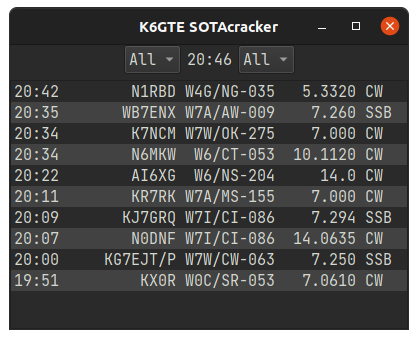

# sotacracker

    

Pulls latest SOTA spots. Displays them in a compact interface. If you have an instance of `flrig` or `rigctld` running, when you click on a spot your radio will automatically tune to the spotted frequency.

- [sotacracker](#sotacracker)
  - [Changes](#changes)
  - [Running from source](#running-from-source)
  - [Building a binary executable](#building-a-binary-executable)
  - [CAT control](#cat-control)

## Changes

Added CAT control. Added commandline options.

## Running from source

If you're running from source you can install Python3, then the required moduals PyQt5 and requests, with pip.

`python3 -m pip3 install -r requirements.txt`

Or if you're the Ubuntu/Debian type you can:

`sudo apt install python3-pyqt5 python3-requests`

## Building a binary executable

I've included a .spec file in case you wished to create your own binary from the source. To use it, first install pyinstaller.

`python3 -m pip3 install pyinstaller`

Then build the binary.

`pyinstaller -F sotacracker.spec`

Look in the newly created dist directory to find your binary.

## CAT control

If no command line options are given, the program will check if either flrig
or rigctld are running on the computer. It will setup CAT control to which
ever it finds first.

You can force it to use either with commandline options.

`-r` will force rigctld with default host:port of localhost:4532.

`-f` will force flrig with default host:port of localhost:12345.

`-s SERVER:PORT` will specify a non-standard host and port.
